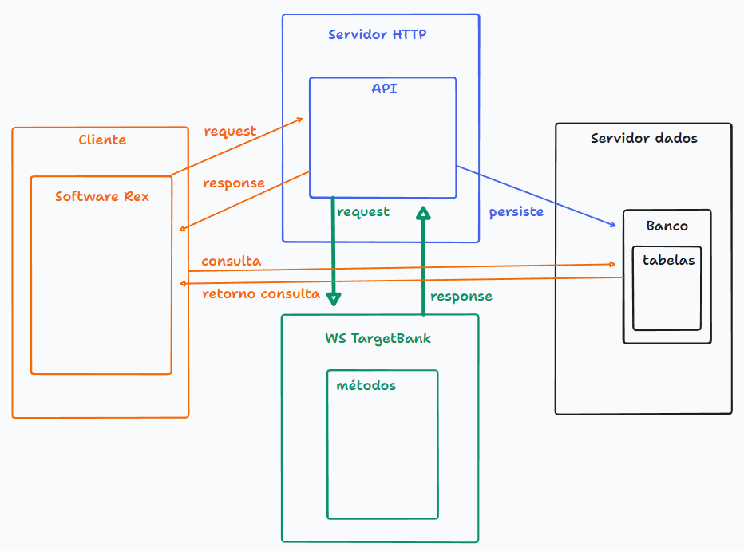

# Projeto API TargetBank - Rex Mobile

Integração do sistema Rex com o Target Bank para geração do CIOT e Vale pedágio.


## Em desenvolvimento

CIOT Padrão - (Cartão Target Conta Digital ou Bradesco) && (Não contém Vale Pedágio)
 métodos:
1- CadastrarAtualizarTransportador
2- CadastrarAtualizarMotorista
3- ObterInformacaoCartao (Cenário 20 ou 21)
4- AssociarSubstituirCartao (Cenário 20 ou 21)
5- CadastrarAtualizarParticipante
6- CadastrarAtualizarOperacaoTransporte
7- DeclararOperacaoTransporte
8- EmitirDocumento (CIOT)
9- EncerrarOperacaoTransporte

## Última alteração
<https://github.com/angelotirelli/Api.TargetBank/commit/2f2c6a2b73760e6e2757623d63e5e193d7a3a30e>

## Métodos que serão implementados
Buscar Transportador

CadastrarAtualizarTransportador

Buscar Motorista

CadastarAtualizarMotorista

BuscarParticipante

CadastrarAtualizarParticipante

CadastrarRoteiro

BuscarRoteiro

ObterCustoRota

CadastrarAtualizarOperacaoTransporte

DeclararOperacaoTransporte

EmitirDocumento

RegistrarParcelaIndividual

PagarParcelaIndividual

ComprarPedagioAvulso

ConfirmarPedagioTag

EncerrarOperaçãoTransporte

BuscaOperacaoTransporte

BuscarCompraValePedagio

CancelarOperacaoTransporte

CancelarCompraValePedagio

## Desenvolvimentos concluídos

Conexão com o banco de dados

CRUD

Métodos GET, POST, PUT e DELETE 

## Documentação da API

#### Retorna todos os itens

```http
  GET /api/cadastro
```

| Parâmetro   | Tipo       | Descrição                           | Obrigatório |
| :---------- | :--------- | :---------------------------------- | :-----------|
| `api_key` | `string` | A chave da sua API | Sim |

#### Retorna um item

```http
  GET /api/cadastro/($id)
```

| Parâmetro   | Tipo       | Descrição                                   | Obrigatório |
| :---------- | :--------- | :------------------------------------------ | :-----------|
| `id`      | `Integer` |  O ID do cadastro que você quer | Sim |


# Target Bank
Link da documentação da Tagert Bank:

<https://targetbank.atlassian.net/wiki/spaces/DOC/pages/402194481/1-+WS+2.0+Frete+Ambientes/>
